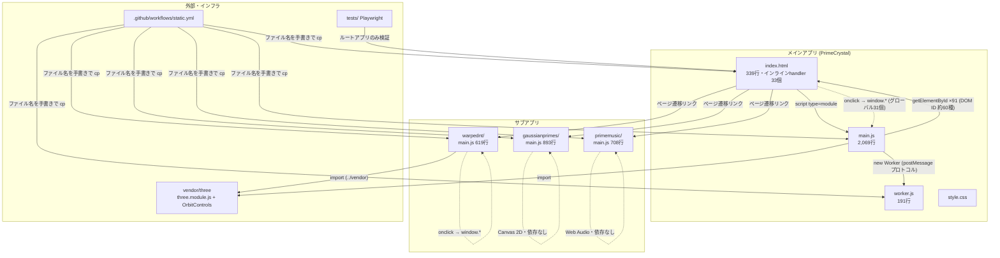

# リファクタリング計画 — 3D Prime Spiral Universe

作成日: 2026-06-11
分析対象: リポジトリ全ファイル(`node_modules/`・`vendor/` を除く git 管理下の全 23 ファイル)
**本ドキュメントは分析と提案のみであり、コードへの変更は一切行っていない。**

---

## 1. 現在の依存関係と構造的ボトルネック

### 1.1 コンポーネント間の有向依存グラフ



点線は「グローバル名前空間 (`window.*`) 経由の暗黙の依存」を表す。

### 1.2 循環依存

| # | 循環 | 実体 |
|---|------|------|
| C1 | **main.js ⇄ index.html** | index.html のインライン `onclick`/`onchange`(33箇所)が `window.setLayout` 等を呼び、main.js は `getElementById` を **91回** 呼んで約60種の DOM ID(`sw-zeta`, `padic-controls`, `boot-stage`…)に直接書き込む。ビューとロジックが互いの内部構造(関数名と要素ID)を知っている双方向結合。HTML 側の ID 変更も JS 側の関数名変更も、もう一方を黙って壊す。 |
| C2 | **updateParticleVisuals ⇄ モード別ビジュアル関数**(main.js 内) | `updateParticleVisuals()` は冒頭でモードフラグを見て `updateNTLVisuals` / `updatePrimeDimVisuals` / `updatePadicColorVisuals` / `_sieveFlushVisuals` へディスパッチし([main.js:1538-1542](../main.js#L1538))、逆に `updatePadicColorVisuals` と `updatePrimeDimVisuals` はモード非アクティブ時に `updateParticleVisuals()` を呼び返す([main.js:1371-1375](../main.js#L1371), [main.js:1476](../main.js#L1476))。相補的なフラグ条件で無限再帰は回避されているが、フラグの整合性という暗黙の契約に依存した相互再帰であり、新モード追加のたびにディスパッチ順序の全箇所を意識する必要がある。 |
| C3 | **デプロイ設定 → 全ソースファイル名**(構成上の逆依存) | [static.yml:38-44](../.github/workflows/static.yml#L38) がデプロイ対象を `cp index.html main.js worker.js style.css …` と**ファイル名のハードコード**で列挙。新しいファイル/ディレクトリの追加は、この YAML を更新し忘れると本番だけ静かに 404 になる。 |

### 1.3 God Object: main.js(2,069行)

main.js は単一モジュールスコープに以下**すべて**を抱える:

- **モジュールレベル可変状態 約50変数**: `currentLayout`, `padicModeActive`, `zetaZeroCount`, `sieveState`, `_maxRenderedCount`, `lerpActive` … 全関数がこれらを直接読み書きし、どの関数がどの状態を所有するか不明。
- **6つの可視化モード**(Zeta / p-adic / PrimeDim / NTL / Sieve / 通常)のロジック・状態・UI同期。
- **数論計算**: ワーカー委譲とフォールバック実装(`_fallbackBuildOnMainThread`)の**二重実装**。
- **レンダリング**: シェーダ文字列、テクスチャ生成、ステレオ分割描画、WebXR。
- **UIバインディング**: 91箇所の DOM 操作、`updateUI()` による全コントロール一括同期。
- **ワーカープロトコル**: `reqId` による stale 結果破棄、転送バッファ採用。
- **ブートシーケンス**: フォントロード、進捗オーバーレイ。

特に深刻なのは**「位置の所有権」という中核概念が暗黙的**なこと。「p-adic / PrimeDim は位置を*占有*し、Zeta / NTL は Z 軸*オーバーレイ*として加算される」というルールが、

- `calculateTargetPositions()` 末尾の if-else 連鎖([main.js:1741-1753](../main.js#L1741))
- `recomputeOnCountChange` の if-else 連鎖([main.js:1230-1246](../main.js#L1230))
- `computeZetaOffsets` の結果破棄条件 `if (padicModeActive || primeDimModeActive) return`([main.js:608](../main.js#L608))
- `updateUIDisabledState()` の排他制御([main.js:1306-1320](../main.js#L1306))
- `updateParticleVisuals()` 冒頭のディスパッチ順([main.js:1539-1542](../main.js#L1539))

の**5箇所以上に分散**して再記述されている。モードを1つ足すには最低この5箇所すべての修正が必要で、漏れてもコンパイルエラーにならず実行時の見た目で初めて壊れる。

### 1.4 知識の重複(コピー&ドリフト)

| 知識 | 重複箇所 | ドリフトの実例 |
|------|---------|----------------|
| `ZETA_ZEROS` 定数表 | **4箇所**: [main.js:564](../main.js#L564)(100個)、[worker.js:9](../worker.js#L9)(100個)、[warpednt/main.js:9](../warpednt/main.js#L9)(20個)、[primemusic/main.js:8](../primemusic/main.js#L8)(50個) | **既に値がズレている**: γ₁₂ が main.js では `56.446248`、warpednt/primemusic では `56.446247`。γ₂₂・γ₂₅ 等も同様。worker.js のコメント自身が「must match main.js」と手動同期を要求している。 |
| エラトステネスの篩 | **5実装**: worker.js、main.js フォールバック、warpednt、gaussianprimes、primemusic | 上限・型・変数名が微妙に異なるだけのほぼ同一コード。 |
| メビウス関数 μ(n) | 4実装(worker / main.js fallback / warpednt / primemusic) | spf 方式と試し割り方式が混在。 |
| 最小素因数 (spf) 篩 | 3実装 | 同上。 |
| p進付値 v_p(n) | 3実装(main.js ×2 — `computePadicValuations` と `computePrimeDimValuations` がほぼ同一ループ、warpednt) | — |
| サイバー調 UI テーマ CSS | 4ファイル(`#ui-overlay`, `.toggle-switch`, `.section-label` 等が4回定義) | フォント読込 `<link>` も4ページに複製。 |
| 素数選択 `<select>`(25択) | index.html 内に**4回**ベタ書き(p-adic ×1、PrimeDim ×3)= 約100行の重複 HTML | — |

### 1.5 レイヤー越え(関心の混線)

- **計算層 → GPU/DOM 直書き**: `_sieveWriteCell()` は篩アルゴリズムの1ステップの中で Three.js のジオメトリ属性に直接書き込み([main.js:287-303](../main.js#L287))、同じフローで `_sieveUpdateStats()` が DOM テキストも更新する。アルゴリズム・描画・UI が1関数チェーンに融合。
- **ワーカークライアント → ブートUI**: `initWorker()` の `onmessage` がプログレスバー DOM を直接操作([main.js:118-129](../main.js#L118))。
- **モードトグル → CSS クラス直接操作**: 全 `toggleXxx` 関数が `classList.toggle('on', …)` と `style.display` をその場で書く。状態とビューの同期が「全コントロールを総なめする `updateUI()`」と「各トグル内の個別更新」の二重経路で行われ、片方だけ更新される抜け道がある。
- **ドキュメント層の現実乖離**: CLAUDE.md は「アプリは3ファイル・テストなし・パッケージマネージャなし」、GEMINI.md は「Tests: None」「`generatePrimes()` が main.js にある」と記述するが、実際には4アプリ構成・pnpm・Playwright テストが存在し、篩は worker.js へ移動済み。AI エージェントへの指示書が古いままだと、誤った前提での自動変更を誘発する(これ自体が構造的リスク)。

### 1.6 サブアプリの評価

`warpednt` / `gaussianprimes` / `primemusic` は**互いに独立しており、これは正しい設計**。問題は分離ではなく、(1.4 の)数学定数・アルゴリズム・テーマ CSS の重複コピーと、テストがルートアプリしかカバーしていない点にある。

---

## 2. アーキテクチャ方針

### 2.1 設計原則

1. **「ビルドなし・3ファイル直配信」という美点は守る。** ES Modules + importmap は現状のまま機能しており、バンドラ導入はこのプロジェクトの性格(教育的・即時リロード)に合わない。リファクタリングは「ファイル分割と import」だけで完結させる。`worker.js` は既に `{ type: 'module' }` で生成されているため、ワーカーからも共有モジュールを import できる。
2. **知識は一箇所に。** 数学的事実(ゼータ零点、篩、数論関数)はアプリ間共有の純粋モジュールへ。
3. **依存方向を一方向に。** `ui → state → math` / `render ← state`。DOM を知るのは ui 層だけ、Three.js を知るのは render 層だけ、数学は何も知らない。
4. **暗黙の契約を型のある構造に。** 「位置オーナー vs オーバーレイ」のモード排他ルールを、分散 if-else ではなく単一の ModeManager に集約する。

### 2.2 目標構造

```
primespiral/
├── shared/                      # 全アプリ共有・純粋関数のみ(DOM/Three.js 禁止)
│   ├── zeta-zeros.js            #   ZETA_ZEROS の唯一の定義(100個)
│   ├── sieve.js                 #   buildSieve(max) → {isPrime, gaps, spf}
│   ├── arithmetic.js            #   mobius, totient, divisors, padicValuation
│   └── theme.css                #   #ui-overlay / .toggle-switch 等の共通テーマ
├── app/                         # メインアプリ(旧 main.js を分割)
│   ├── main.js                  #   composition root(boot + 配線のみ、~150行)
│   ├── state.js                 #   アプリ状態の唯一の置き場 + 変更通知
│   ├── modes/                   #   1モード=1ファイル(共通インタフェース)
│   │   ├── mode-manager.js      #   owner/overlay スロット管理・排他制御の唯一の場所
│   │   ├── zeta.js  padic.js  prime-dim.js  ntl.js  sieve-anim.js
│   ├── render/                  #   Three.js を知る唯一の層
│   │   ├── particles.js         #   geometry / ShaderMaterial / テクスチャ生成
│   │   ├── lattice.js           #   calculateTargetPositions(レイアウト+フィル順)
│   │   └── loop.js              #   animate / lerp / stereo / XR
│   ├── ui/                      #   DOM を知る唯一の層
│   │   ├── bindings.js          #   addEventListener 一括登録(window.* 全廃)
│   │   └── panels.js            #   updateUI / type panel / tooltip / boot overlay
│   └── worker-client.js         #   reqId プロトコル・転送バッファ受領
├── worker.js                    # shared/ を import する薄い計算ホスト
├── warpednt/ gaussianprimes/ primemusic/   # shared/ を import、構造は現状維持
└── index.html                   # インラインhandler撤去、data-action 属性のみ
```

### 2.3 モードの共通インタフェース(排他ルールの一元化)

```js
// 各モードが実装する形(概念図)
{
  id: 'padic',
  kind: 'owner',        // 'owner' = 位置を占有 / 'overlay' = Z軸加算
  enter(ctx) {},        // 有効化: 計算+位置+ビジュアル
  exit(ctx) {},         // 無効化: 後片付け
  onCountChange(ctx) {},// Point Count スライダー変更時
  computeVisuals(ctx) {},
}
```

ModeManager が「owner は同時に1つ」「owner 有効時は overlay と格子 UI を無効化」「stale なワーカー結果は現 owner が違えば破棄」を**一箇所で**裁定する。現在5箇所に散る if-else 連鎖(§1.3)はすべてここに吸収され、新モード追加は「ファイル1個 + 登録1行」になる。

### 2.4 UI バインディングの方針

- index.html のインライン `onclick` / `onchange`(33箇所)を撤去し、`data-action="setLayout"` 等の宣言的属性 + `ui/bindings.js` での一括 `addEventListener` に置換。`window.*` グローバル31個を全廃する。
- DOM ID 文字列の散在(91箇所)は、`ui/` 層先頭の要素参照テーブル(1回だけ `getElementById` してキャッシュ)に集約。ID変更の影響範囲が1ファイルになる。
- 状態→UI の同期は「state 変更 → 通知 → ui が再描画」の一方向のみとし、トグル内の個別 DOM 更新と `updateUI()` 総なめの二重経路を解消する。

### 2.5 インフラの方針

- static.yml の手書き `cp` リストを「リポジトリ全体からデプロイ不要物(`tests/`, `scripts/`, `docs/`, dotfiles, `package.json` 等)を除外コピー」する方式へ反転。ファイル追加がデプロイ更新を要求しない構造にする。
- Playwright テストをサブアプリ3つの煙テスト(ロード+主要操作1つ+pageerror ゼロ)まで拡張し、リファクタリングの安全網とする。
- CLAUDE.md / GEMINI.md / README.md を現実(4アプリ・worker・pnpm・テストあり)に同期する。

---

## 3. 段階的リファクタリング・ロードマップ

各フェーズは独立してデプロイ可能で、いつでも中断できる。**Phase 1 以外は挙動を一切変えない(振る舞い保存リファクタリング)。**

### Phase 1 — 安全網とドキュメントの真実化(コード移動なし)

- **目的**: 以降のフェーズを検証可能にする。嘘をついているドキュメントを直す。
- **対象ファイル**:
  - `tests/` — サブアプリ3つ(warpednt / gaussianprimes / primemusic)の煙テスト追加。メインアプリは「p-adic と PrimeDim の排他」「count スライダー変更後の各モード再計算」など、Phase 3〜4 で壊しやすい挙動のテストを追加。
  - `CLAUDE.md`, `GEMINI.md`, `README.md` — 4アプリ構成・worker.js・pnpm/Playwright・vendor 化された Three.js を正しく記述。
- **完了条件**: ① `pnpm test` で4アプリ全てに対し pageerror ゼロのテストが通る。② ドキュメントに現実と矛盾する記述(「テストなし」「3ファイル」「generatePrimes が main.js にある」等)が残っていない。

### Phase 2 — 共有数学コアの抽出(重複の根絶)

- **目的**: §1.4 の知識重複を解消し、既に発生している `ZETA_ZEROS` の値ドリフトを止める。
- **対象ファイル**:
  - 新規: `shared/zeta-zeros.js`(100個・出典コメント付きの唯一の定義)、`shared/sieve.js`、`shared/arithmetic.js`(mobius / totient / padicValuation / divisor 系)。
  - 修正: `main.js`, `worker.js`, `warpednt/main.js`, `primemusic/main.js`, `gaussianprimes/main.js` — 各自のコピーを削除し import に置換。`main.js` の `_fallbackBuildOnMainThread` と `worker.js` の `buildSieves` は同一の shared 実装を呼ぶ薄いラッパに統一。
  - 修正: `.github/workflows/static.yml` — `shared/` をデプロイ対象に追加(暫定。方式反転は Phase 5)。
- **完了条件**: ① `ZETA_ZEROS` と篩の定義がリポジトリ内に各1つ。② `grep -r "14.134725"` のヒットが `shared/zeta-zeros.js` のみ。③ Phase 1 のテストが全て green。④ デプロイ後の本番でも4アプリが動作。

### Phase 3 — main.js の層分割(God Object の解体)

- **目的**: 2,069行の main.js を §2.2 の `app/` 構造へ機械的に分割し、依存方向を一方向化する。モードの挙動はまだ変えない。
- **対象ファイル**:
  - 新規: `app/render/lattice.js`(`calculateTargetPositions` + 候補キャッシュ)、`app/render/particles.js`(シェーダ・テクスチャ・`createParticles`)、`app/render/loop.js`(`animate`・ステレオ・XR)、`app/worker-client.js`(`initWorker`/`requestZetaOffsets`/reqId 管理)、`app/state.js`(モジュールレベル変数約50個の引っ越し先)、`app/main.js`(boot + 配線)。
  - 修正: `index.html` — script 参照先を `app/main.js` に変更。`worker.js` のパス指定を維持。
  - 修正: `.github/workflows/static.yml`。
- **分割順序の推奨**: 依存が一方向な「葉」から。①テクスチャ/シェーダ → ②lattice → ③worker-client → ④state → ⑤boot。
- **完了条件**: ① 旧 `main.js` が削除され、`app/main.js` は import と起動配線のみ(目安 200行未満)。② `shared/` と `app/render/` のどのファイルにも `document.` / `getElementById` が出現しない(層越え検査は grep で機械的に確認可能)。③ テスト green。

### Phase 4 — モードプラグイン化と UI バインディング層(循環依存の切断)

- **目的**: 循環 C1(main.js ⇄ index.html)と C2(visuals 相互再帰)を切断し、5箇所に散ったモード排他ルールを ModeManager に一元化する。
- **対象ファイル**:
  - 新規: `app/modes/mode-manager.js` と `app/modes/{zeta,padic,prime-dim,ntl,sieve-anim}.js`、`app/ui/bindings.js`、`app/ui/panels.js`。
  - 修正: `index.html` — インライン `onclick`/`onchange` 33箇所を `data-action` 属性へ置換。素数選択 `<select>` 4個の重複 option 約100行は `panels.js` で生成。
  - 削除: `window.setLayout` 等のグローバル公開31個すべて。
- **完了条件**: ① `index.html` に `onclick=`/`onchange=`/`oninput=` が0件。② `window.xxx =` への代入が `app/` 配下に0件。③ 「位置オーナー排他」「count 変更時の再計算」「stale ワーカー結果破棄」のロジックが `mode-manager.js` 1ファイルにのみ存在する。④ 新モードのダミー追加が「新ファイル1つ + 登録1行 + HTMLパネル1ブロック」で完結することを確認。⑤ テスト green。

### Phase 5 — インフラ・テーマの仕上げ(任意)

- **目的**: 構成上の逆依存 C3 の解消と、4重 CSS テーマの統合。
- **対象ファイル**:
  - `.github/workflows/static.yml` — 手書き `cp` リストを除外方式(rsync `--exclude` 等)へ反転。
  - 新規 `shared/theme.css` + 修正 `style.css`, `warpednt/style.css`, `gaussianprimes/style.css`, `primemusic/style.css` — 共通テーマを import し、各ファイルはアプリ固有差分のみに縮小。
  - (任意)`warpednt/main.js` のパーティクル描画を `app/render/particles.js` の再利用に置換。
- **完了条件**: ① 新規ファイルを追加して push しても YAML 修正なしで本番に反映される。② `.toggle-switch` の定義がリポジトリ内に1つ。③ 全テスト green・本番4アプリ動作確認。

### フェーズ共通の注意

- 各フェーズの完了 = 「テスト green + GitHub Pages 上で4アプリ動作確認」を満たしてから次へ進む。
- `vendor/three` のバージョン固定(0.167.0)はこの計画では変更しない。importmap のパスは Phase 3 でディレクトリが変わる場合のみ要調整(`app/` から見た相対パスではなく、importmap は HTML 基準なので変更不要のはず — 要確認項目として残す)。

---

## 付録: 分析中に見つけた小さな不整合(本計画の対象外だが記録)

- `warpednt/main.js` の `showLabels` トグルは状態を反転するだけで、ラベル描画がどこにも実装されておらず無効果([warpednt/main.js:563-566](../warpednt/main.js#L563))。
- `primemusic/main.js` の `drawLoop` 内 `elapsed` が計算されるが未使用([primemusic/main.js:402](../primemusic/main.js#L402))。
- `ZETA_ZEROS` の値ドリフト(§1.4)— Phase 2 で正値(Odlyzko 表)に統一する際、どの値が正かの検証を含めること。
- GEMINI.md が参照する `generatePrimes()` は main.js にもう存在しない(worker.js へ移動済み)。
